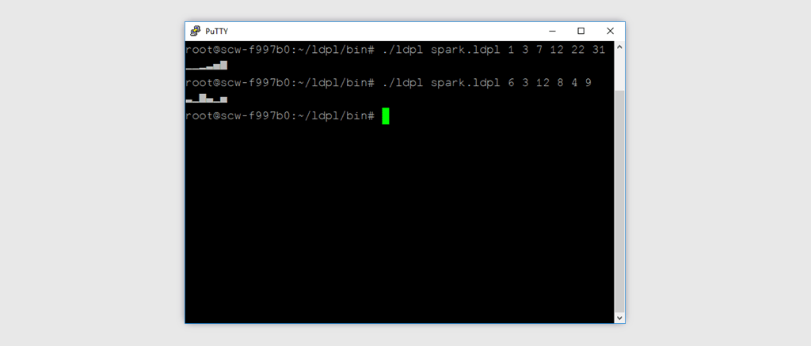

# LDPL Spark

[](LICENSE)
[](https://gitmoji.carloscuesta.me)



This is a port to LDPL of the [BASH Shell script spark](https://github.com/holman/spark). It doesn't 100% duplicate the functionality because you can't pipe values in nor will it accept comer delimited input (yet?)

[LDPL](http://ldpl.lartu.net/) is a very simple interpreted programming language that mimics older languages like COBOL. Its author Martín del Río designed it from the ground up to be excessively expressive, readable and easy to learn.

You can obtain the LDPL interpreter from [here](https://github.com/Lartu/ldpl/releases) and once in your `$PATH` run the game by running `ldpl spark.ldpl`.

```
# ./ldpl spark.ldpl 1 3 7 12 22 31
▁▁▂▃▅█

./ldpl spark.ldpl 6 3 12 8 4 9
▃▁█▄▁▅
```
